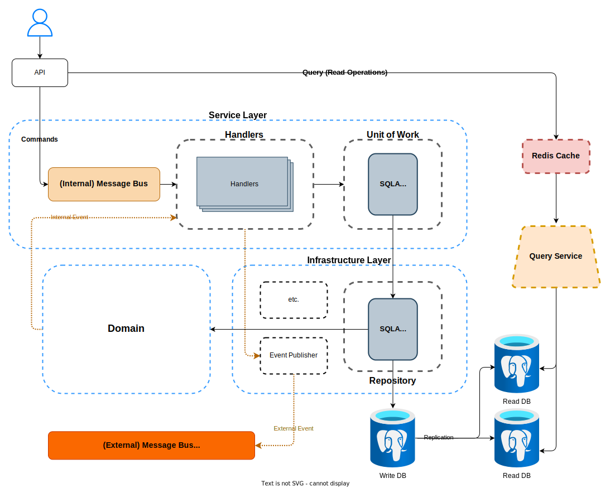

# Event-Driven Order Service with DDD

This project showcases an advanced Order Service built using Domain-Driven Design (DDD), Test-Driven Design (TDD) principles, and an event-driven architecture. 

### Architecture


### TODO:
- [] Redis caching
- [] External Events publisher to RabbitMQ

### Tech Stack
- Python
- FastAPI
- RabbitMQ 
- PostgreSQL
- Redis
- Docker

### Code Architecture
```
envs/
src/
├─ core/                    # settings and other configurations
├─ features/
│  ├─ allocation/
│  │  ├─ api/               # command (write) service
│  │  ├─ views/             # query (read) service
│  │  ├─ service_layer/     # message bus and handlers
│  │  ├─ domain/            # business logic
│  │  ├─ infrastructure/    # db, email and other adapters.
├─ main.py
tests/
├─ e2e/
├─ integration/
├─ unit/
```


### Project Setup
This project utilizes Docker Compose to run the application.

```bash
docker-compose up -d
```

### License
This project is licensed under the terms of the MIT license.

